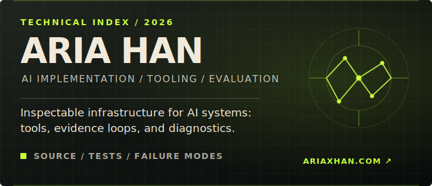
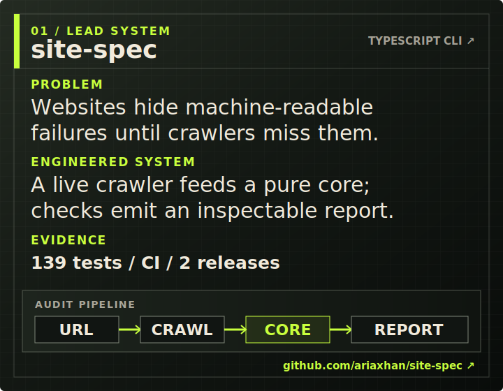
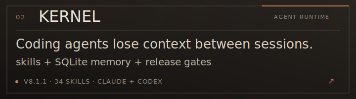
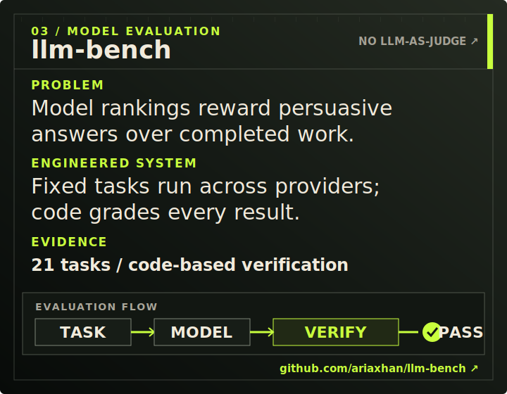
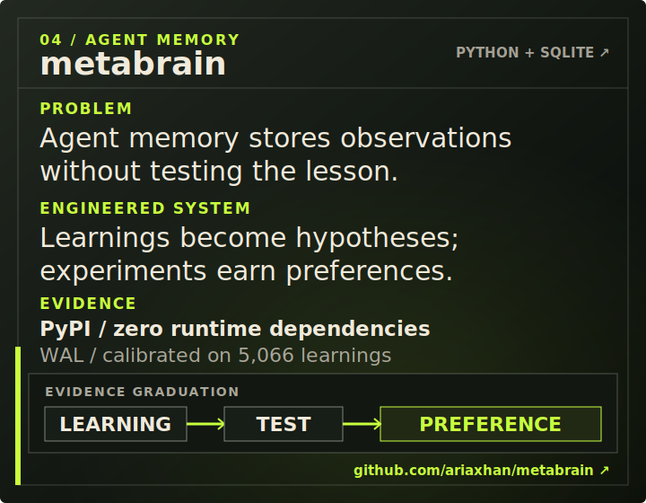
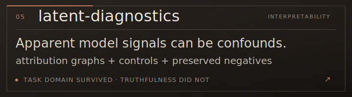

# Aria Han

I build inspectable infrastructure around AI models: deterministic tools, evaluation systems, agent memory, and diagnostics.

This is the technical index. For the broader story, products, and writing, visit **[ariaxhan.com](https://ariaxhan.com)**.

## Selected systems

### [01 / site-spec](https://github.com/ariaxhan/site-spec)

### [02 / kernel-claude](https://github.com/ariaxhan/kernel-claude)

### [03 / llm-bench](https://github.com/ariaxhan/llm-bench)

### [04 / metabrain](https://github.com/ariaxhan/metabrain)

### [05 / latent-diagnostics](https://github.com/ariaxhan/latent-diagnostics)

---

[Website](https://ariaxhan.com) · [Email](mailto:ariaxhan@gmail.com) · [LinkedIn](https://linkedin.com/in/ariahan)
